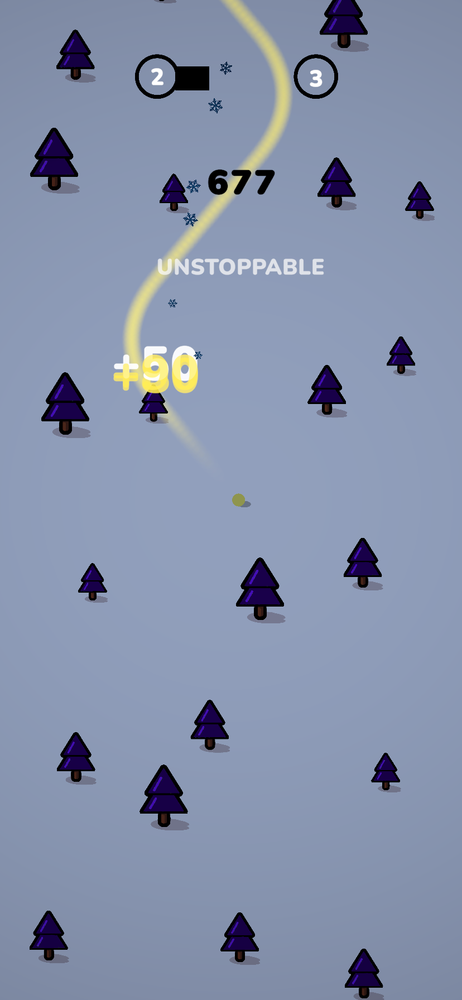
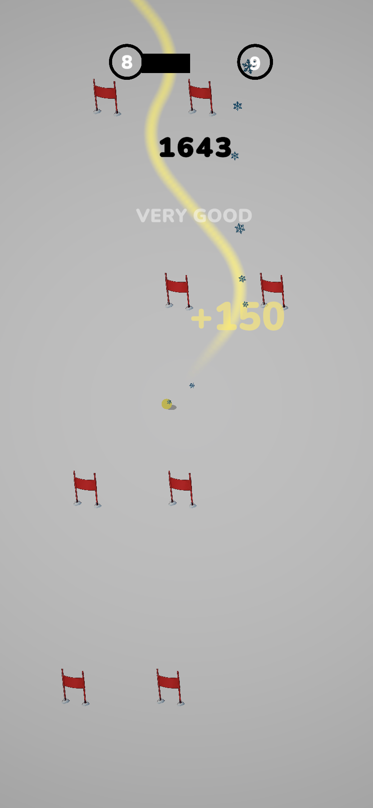
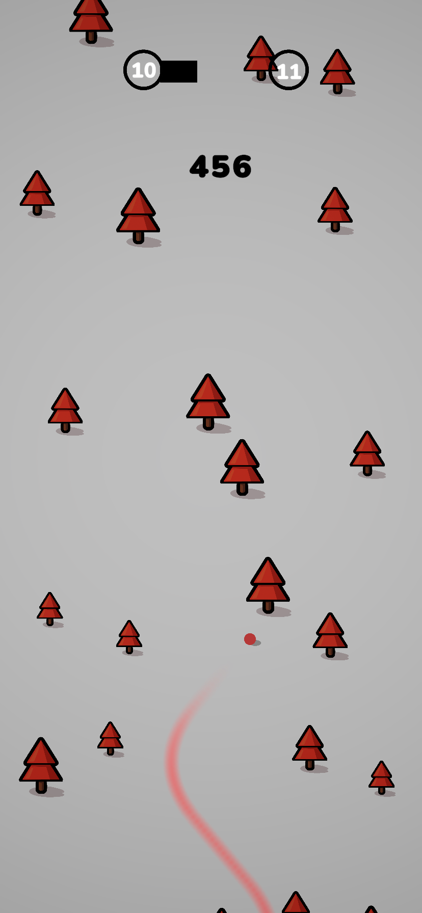

<h1 align="center">
  
  Mount Harv
</h1>

  <b>Fast. Cold. Unforgiving.</b> 
  Race down the mountain and test your limits.

  
  
  

---

## 🎮 About the Game

**Mount Harv** is a fast-paced downhill arcade experience where speed meets precision.  
Slide through snowy mountains, avoid obstacles, and push your reflexes to the limit.

> One mistake — and it's over.

---

## ⚡ Features

- 🏂 Smooth downhill movement  
- 🤖 AI opponents (Challenge Mode)  
- ❄️ Minimalist snowy aesthetics  
- 🎯 High-score based gameplay  
- 🔥 Fast, addictive runs  

---

## 🕹️ Gameplay

- Control your character while speeding downhill  
- Dodge obstacles and survive as long as possible  
- Compete against bots in Challenge Mode  
- Beat your high score  

---

## 📸 Screenshots

  
   
   

---

## 🚀 Roadmap

- [ ] New maps  
- [ ] More characters  
- [ ] Sound & music improvements  
- [ ] Online leaderboard  

---

## 🛠️ Tech Stack

- Unity  
- C#  
- Mobile Optimization  

